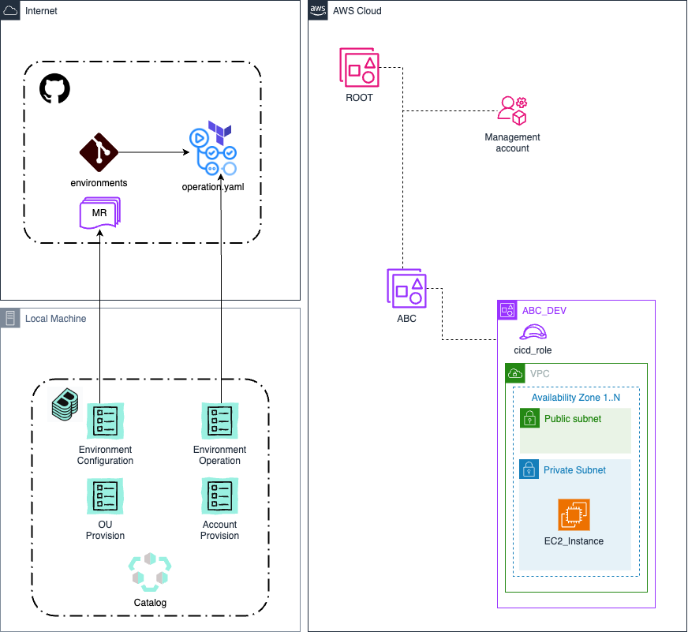

# Backstage integrated AWS account provisioning
This repo provides an example lightweight solution enabling the provisioning of Control Tower-integrated AWS OUs and accounts via GitHub Actions.
The main focus of this repo is the Backstage integration and the automated resource provisioning within accounts.

To see more details about the OU and account vending automation, see the repo [aws_management](https://github.com/tamer84/aws_management).

## Getting started
This project builds upon the implementation hosted in the  [aws_management](https://github.com/tamer84/aws_management) repo.  
Once the OU and account automation is in place, and at least one account has been created, you can proceed with this setup.  
Clone/Fork this repo into your own GitHub org and continue.  

## Backstage Setup
### Backstage Install
Backstage is not provided as part of this repo, and detailed setup instructions are also not provided.  
If you want to industrialize the setup after trying it out, there are deployment instructions available at the [official Backstage documentation](https://backstage.io/docs/deployment/).  

For this simple example, it's enough to launch Backstage locally.  
Just follow the [getting-started](https://backstage.io/docs/getting-started/) instructions provided by Backstage to get the sources.  

### Backstage Configuration
This setup requires [GitHub actions to be installed](https://backstage.io/docs/features/software-templates/builtin-actions/), so that the GitHub MR can be created.  

From backstage root dir call:  
`yarn --cwd packages/backend add @backstage/plugin-scaffolder-backend-module-github`

and add to `/packages/backend/src/index.ts`:  
`backend.add(import('@backstage/plugin-scaffolder-backend-module-github'));`

To be able to discover the Catalog Entities from GitHub (and to trigger the eventual MR), Backstage requires a Token with the scopes (repo, workflow) for GitHub.  
For this simple scenario, it is enough to [create a PAT](https://docs.github.com/en/authentication/keeping-your-account-and-data-secure/managing-your-personal-access-tokens#creating-a-personal-access-token-classic) and set it as an environment variable (GITHUB_TOKEN).  

Finally, copy over the [example app-config.yaml](.backstage/config/app-config.yaml) from this repo.  

````
catalog:
  orphanStrategy: delete
  processingInterval: { minutes: 3 }
  import:
    entityFilename: catalog-info.yaml
    pullRequestBranchName: backstage-integration
  rules:
    - allow: [Component, System, API, Resource, Location, Domain, Template]
  locations:
    - type: url
      target: https://github.com/<<YOUR_GITHUB_ORG>>/aws_management/blob/main/catalog-info.yaml
    - type: url
      target: https://github.com/<<YOUR_GITHUB_ORG>>/aws_environments/blob/main/catalog-info.yaml
````
Make sure you modify the catalog location URLs to point to your own GitHub clones/forks of these repos.

### Launch Backstage
Its time to [start Backstage](https://backstage.io/docs/getting-started/#2-run-the-backstage-app).
````
cd my-backstage-app # your app name
yarn dev
````

## Backstage catalog
If everything has gone to plan, you should see Backstage starting up and available on your [localhost](http://localhost:3000/catalog) with two entries in the catalog, AWS Management and AWS Environments.
To understand what the Catalog is, please check the [Backstage documentation](https://backstage.io/docs/features/software-catalog/).

### Ecosystem Model
The OUs and accounts created in the management repo are represented in the Backstage Catalog based on the [Backstage System Model](https://backstage.io/docs/features/software-catalog/system-model).

#### Domains
Any OU you create in AWS via the automation in [aws_management](https://github.com/tamer84/aws_management) should have a catalog entry here.  

#### Systems
Any account you create in AWS via the automation in [aws_management](https://github.com/tamer84/aws_management) should have a catalog entry here.

### Templates
The Templates [AWS Environment Provision/Update](.backstage/templates/aws-environment-provision.yaml) and [AWS Environment Operation](.backstage/templates/aws-environment-operation.yaml) will also be imported in Backstage if configured correctly.  
They will be visible in the Catalog as entities of type [Template](https://backstage.io/docs/features/software-catalog/system-model#template).  
Where they really become useful is visible in the [/create](http://localhost:3000/create) endpoint of your local Backstage deployment...

## Deployments
Now things start to get interesting!  


The Template [AWS Environment Provision/Update](.backstage/templates/aws-environment-provision.yaml) can be launched to create the terraform variables for an environment deployment.  
This repo contains a simple example, but it suffices to demonstrate how the templating works.  
The Backstage template gathers the configuration inputs from the user in the frontend, uses the templating action built into the Backstage Scaffolder, and creates an MR in the repo.  
Approving the MR merges the configuration to the `main` branch.  

The Template [AWS Environment Operation](.backstage/templates/aws-environment-operation.yaml) can be used to trigger a GitHub workflow to create/update/destroy an AWS accounts resources.  
In real life scenarios, the merging of the MR would lead to some kind of approval flow (automated or semi-manual) before triggering the rollout to the environemnt.  

For the sake of simplicity, this repo demonstrates Backstage directly calling GitHub workflows from Backstage.
